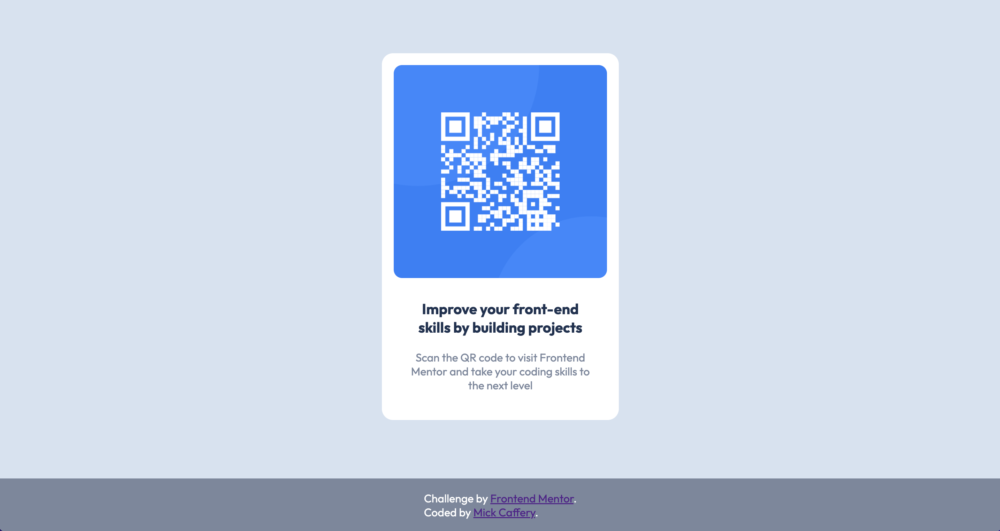

# Frontend Mentor - QR code component solution

This is a solution to the [QR code component challenge on Frontend Mentor](https://www.frontendmentor.io/challenges/qr-code-component-iux_sIO_H). Frontend Mentor challenges help you improve your coding skills by building realistic projects. 

## Table of contents

- [Frontend Mentor - QR code component solution](#frontend-mentor---qr-code-component-solution)
  - [Table of contents](#table-of-contents)
  - [Overview](#overview)
    - [Solution Screenshots](#solution-screenshots)
    - [Links](#links)
  - [My process](#my-process)
    - [Built with](#built-with)
    - [What I learned](#what-i-learned)
    - [Continued development](#continued-development)
    - [Useful resources](#useful-resources)
  - [Author](#author)

## Overview

### Solution Screenshots

Desktop view

Mobile view

### Links

- Live Site URL: [https://visionary-gnome-1e15c6.netlify.app/](https://visionary-gnome-1e15c6.netlify.app/)
- [Front End Mentor Solution](https://www.frontendmentor.io/challenges/qr-code-component-iux_sIO_H)

## My process

### Built with

- Semantic HTML5 markup
- CSS custom properties
- Mobile-first workflow

### What I learned

This was my first Front-End Mentor challenge. I chose to complete their recommended 'first challenge' to test out the Front-End Mentor platform.

In regards to the QR component, I used `text-align: center` and `margin: auto` to center the elements. An alternative way would have been to use flexbox.

For the **footer**, I learnt that elements can be fixed to the bottom of the viewport using `bottom: 0`.

### Continued development

I really enjoyed my first Front-End Mentor Challenge. I think it is a great way to improve my front-end skills and look forward to trying further challenges. 

### Useful resources

- [Fixed footer tutorial](https://www.w3schools.com/howto/howto_css_fixed_footer.asp) - This w3schools tutorial helped me understand how to fix a footer to the bottom of the viewport.

## Author

- GitHub - [Mick Caffery](https://github.com/mickcaff)
- Frontend Mentor - [@mickcaff](https://www.frontendmentor.io/profile/mickcaff)
- [LinkedIn](https://www.linkedin.com/in/mcaffery/)

